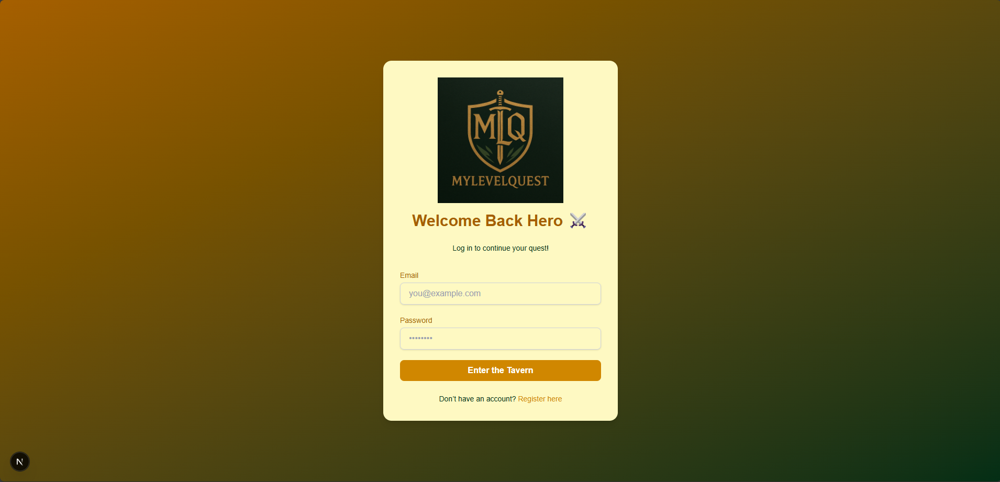
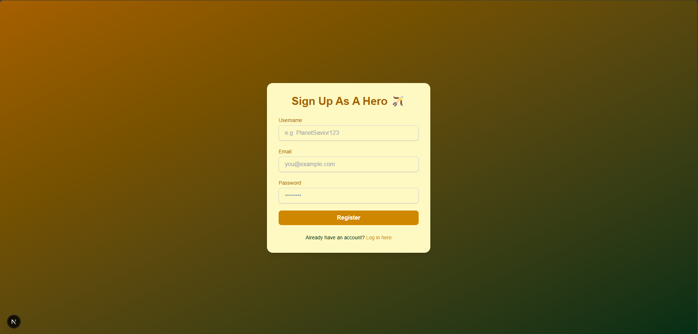
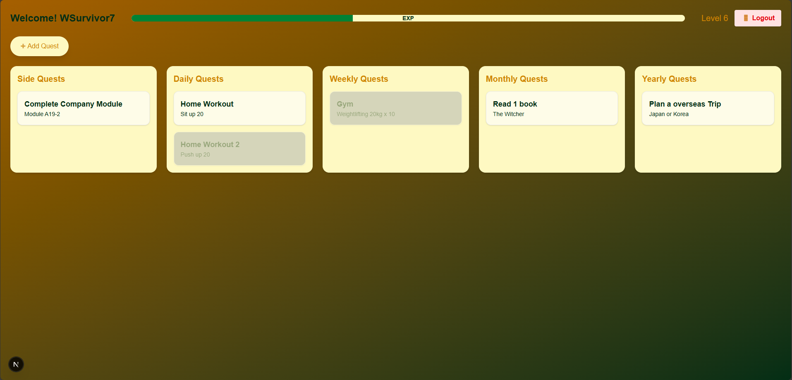
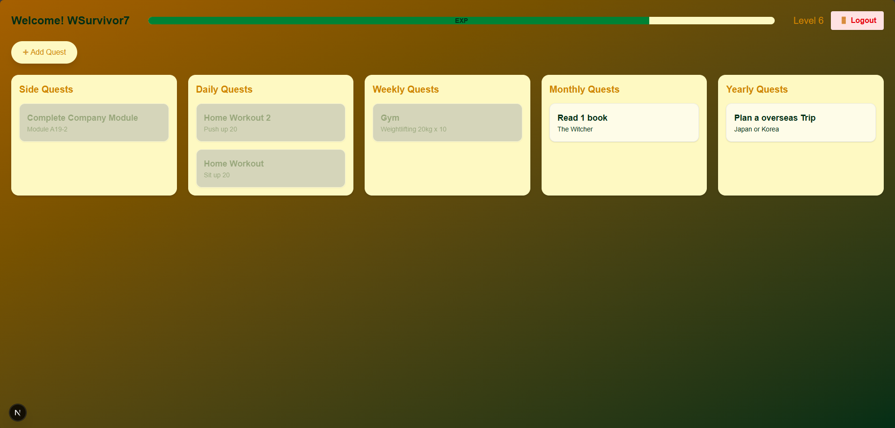
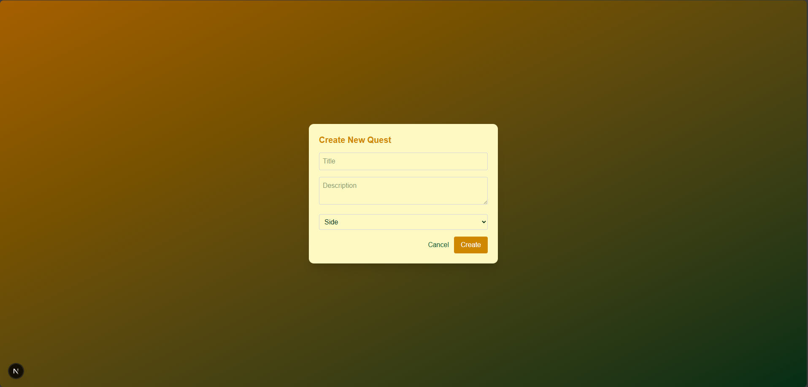
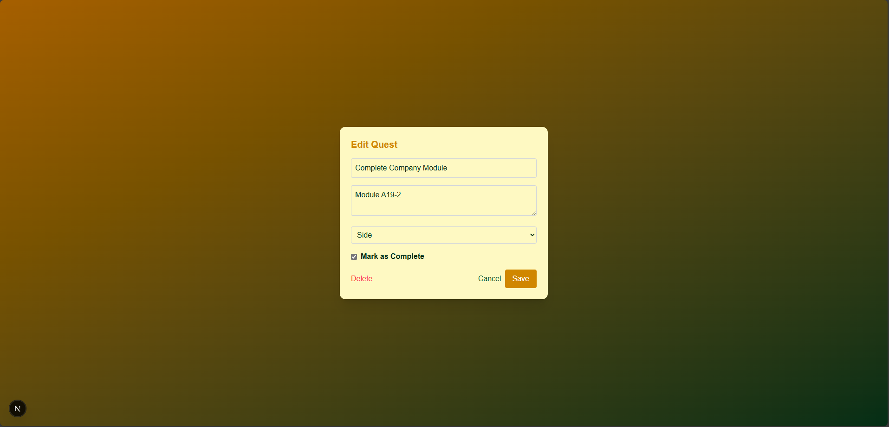

# 🛡️ MyLevelQuest

**MyLevelQuest** is a fantasy-themed productivity web application that gamifies task management. Users embark on their personal quests (tasks) and level up by completing them — turning everyday responsibilities into heroic adventures.

---

## 🏗️ Tech Stack

### 🌐 Frontend
- **React** – for building interactive UI components.
- **Next.js** – for server-side rendering and routing.
- **Tailwind CSS** – for rapid, utility-first styling.
- **HTML5 & JavaScript/TypeScript** – for structured and dynamic content.

### ⚙️ Backend
- **.NET Core (C#)** – for building robust RESTful APIs.
- **ASP.NET Web API** – for secure and scalable backend logic.
- **Entity Framework Core** – for data modeling and database access.
- **PostgreSQL** –  relational data storage.

### ☁️  Enhancements 
- **JWT Authentication** – for secure user login and session management.
- **Level-up system** — increse productivity by leveling up.

### 🌱  Future Enhancements (Coming soon)
**Brain-storming!** — let me know if you have any ideas on how to enhance this system to make it more fun!

---

## 🚀 Getting Started

To test this project on your local machine:

### 1. Clone the Repository

```bash
git clone https://github.com/troyleong7/MyLevelQuest.git
cd MyLevelQuest
```

### 2. Run the Backend (.NET Core API)
```bash
cd MyLevelQuest.API
dotnet run
```
- Make sure you have the .NET SDK installed: https://dotnet.microsoft.com/en-us/download

- The backend should now be running at https://localhost:5163 (or a similar port).

### 3. Run the Frontend (React + Next.js)
In a new terminal:
```bash
cd mylevelquest-frontend
npm install
npm run dev
```
- Make sure you have Node.js and npm installed: https://nodejs.org/

- The frontend should now be running at http://localhost:3000

## 📸 Screenshots

### 🔐 User Login 


### 🆕 User Register 


### 🧭 Dashboard View  
**Before completing a quest**



**After completing a quest**



### ✍️ Task Creation  


### ✏️ Task Edit


## 🛠️ Contributing

This is a personal project to train my full-stack developmenet skills. Suggestions are welcome! Feel free reach out to me if you have any ideas!

## 📬 Contact

Built by Troy Leong

Reach me at: troyleong@hotmail.com